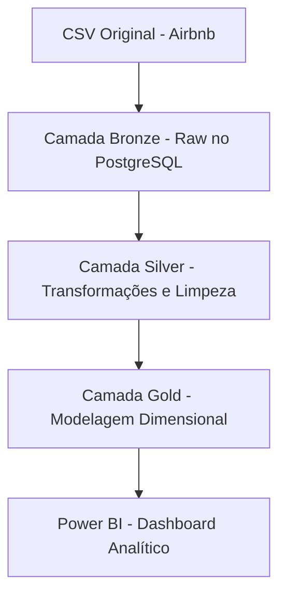

# 🏠 Projeto Airbnb Analytics DW – Ingestão com Python, PostgreSQL e Visualização com Power BI

Este projeto simula um pipeline de dados completo para análise de hospedagens no Airbnb no Rio de Janeiro. A estrutura segue o padrão **medalhão (Bronze, Silver e Gold)** com armazenamento em **PostgreSQL**, ingestão via **Python** e visualização em **Power BI**.

---

## 🎯 Objetivo Geral

- Construir um pipeline moderno de dados.
- Utilizar boas práticas de **engenharia de dados**, **modelagem dimensional** e **Data viz**
- Praticar SQL do básico ao avançado com dados reais.
- Entregar **insights visuais** usando Power BI.

---

## 🧱 Arquitetura em Camadas



- **Bronze**: Ingestão bruta dos arquivos `.csv` originais.
- **Silver**: Limpeza, normalização e padronização dos dados.
- **Gold**: Criação de tabelas fato e dimensões otimizadas para análise.

---

## 🛠️ Principais Tecnologias

| Tecnologia      | Finalidade                                    |
|-----------------|-----------------------------------------------|
| **PostgreSQL**  | Armazenamento e modelagem de dados            |
| **Python**      | Ingestão automatizada com `pandas` e `psycopg2` |
| **SQL**         | Transformações, análises e criação de ERDs    |
| **Power BI**    | Visualização de KPIs e painéis interativos    |
| **VS Code**     | Edição de scripts, versionamento e organização |
| **dotenv**      | Gerenciamento seguro de credenciais           |

---

## ⚙️ Pipeline de Ingestão

- **Arquivos CSV originais** são armazenados em `/dados/row/`.
- Utiliza `psycopg2` com `execute_batch` para ingestão performática.
- Armazena em diferentes tabelas dentro do schema `bronze` no PostgreSQL.
- Criação de tabela de controle para **evitar reprocessamento** de arquivos já inseridos.

---

## 📁 Estrutura do Projeto

```bash
airbnb-analytics-dw/
├── dados/
│   └── row/ 
│   └── exemplo_amostra.csv                     # Arquivos originais CSV
├── scripts/
│   └── extract_load_csv.py      # Script de ingestão com Python
│   └── .env                     # Credenciais de conexao com banco de dados
├── sql/
│   ├── ddl/                      # Criação de tabelas (Bronze/Silver/Gold)
│        └── 1_DDL_CRIACAO_DE_SCHEMAS_BRONZE_SILVER_GOLD
│        └── 2_DDL_CRIACAO_TABELAS_BRONZE
│        └── 2_DDL_CRIACAO_TABELAS_BRONZE│
│   ├── dml/                      # Scripts de transformação SQL
│   └── consultas/                # SQL para análises
├── powerbi/
│   └── dashboard.pbix            # Dashboard final em Power BI
├── notebooks/                    # (Opcional) Jupyter para exploração
├── .env                          # Variáveis de conexão com o banco
└── README.md
```

---

## 🔐 Boas Práticas Adotadas

- Uso de `.env` para proteger as credenciais de banco.
- Scripts organizados por finalidade (ETL, análise, dashboard).
- Criação de `tabela de controle` para arquivos processados.
- Uso de **chaves primárias e estrangeiras** com modelagem em **Star Schema**.
- Separação lógica dos dados nas camadas Bronze, Silver e Gold.

---

## 🧪 Exemplo de Query SQL

```sql
-- Top 10 bairros com maior preço médio de diária
SELECT 
  bairro, 
  ROUND(AVG(preco), 2) AS media_preco
FROM gold_fato_precificacao
JOIN gold_dim_localizacao USING(fk_anuncio)
GROUP BY bairro
ORDER BY media_preco DESC
LIMIT 10;
```

---

## 📊 Dashboard no Power BI

> *[Adicione aqui o link ou print do Power BI assim que estiver pronto]*

### KPIs e Visões:
- Preço médio por bairro e tipo de acomodação.
- Distribuição de reviews e avaliações.
- Mapa com localizações e disponibilidade.
- Evolução mensal de reservas e comparativos.

---

## 👨‍💻 Autor

**Jonathan Almeida**  
[LinkedIn](https://www.linkedin.com/in/jonathan-mesquita-3049581b1) • [Portfólio](https://mypersonalportifolio.streamlit.app)  


---


## 📦 Fonte dos Dados

- [Airbnb Listings Rio de Janeiro – Kaggle](https://www.kaggle.com/datasets/thaysagomes/rio-airbnb)